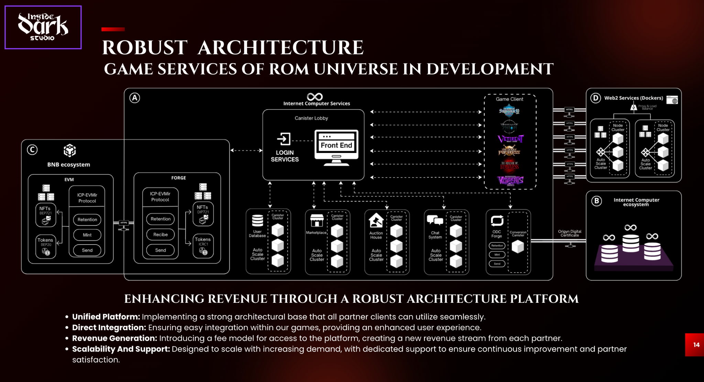

# UN-LOGIN-IC-IDS

Canister for **login** and **communication bridge** between the **WSS proxy** (receiving connections from the **Unreal Engine client**) and the rest of Inside Dark Studio's infrastructure on the **Internet Computer (IC)**.  
This repository was originally created from the `dfx new` template (ids-website). This README reorganizes the project and documents the **architecture**, **components**, **interfaces**, and the **development & deployment flow**.

---

## 📦 Canister Purpose

- Manage **identity and session** for players/partners.
- Persist **user profiles** and **session tokens** in a **Motoko-based database**.
- Provide a **Candid API** consumable by:
  - **WSS Proxy** connected to Unreal.
  - **Front End web** (login flows, dashboards, landing).
  - Other **canisters** (Marketplace, Chat, Auction House, etc.).
- Sign and forward messages to **IC services** and **Web2 services** (dockers) according to policies.

---

## 🧱 High-Level Architecture



**Main components**:

1. **Game Client (Unreal)** → connects to the **WSS Proxy**.
2. **WSS Proxy** → normalizes messages, applies rate-limit and retries; calls **UN-LOGIN-IC-IDS canister** via `ic-agent`.
3. **UN-LOGIN-IC-IDS (this repo)** →
   - Authentication (delegations / sessions).
   - Profile and account links (principal, anonymous, wallet, partnerId).
   - Issuance/validation of **ephemeral tokens** for Game Services.
   - Hooks/calls to other canisters (Marketplace, Chat, Auction House, ODC Forge, etc.).
4. **Canister Lobby / Front End** → public UI and dashboards; consumes the canister’s API.
5. **Web2 Services (Dockers)** → batch/ingestion/analytics (with **Origin Digital Certificate** when crossing to Web2).

> The login canister is the **entry point** to the ROM Universe service mesh on IC.

---

## 🗂️ Suggested Repo Structure

```
/src
  /un_login_ic_ids
    Main.mo               # Main canister logic
    types.mo              # Types, errors, DTOs
    storage.mo            # Persistence layer (stable vars / trie / hashmap)
    auth.mo               # Session, tokens, delegations
    wss_bridge.mo         # Adapters for WSS proxy messages
/idl
  un_login_ic_ids.did     # Candid interface
/docs
  architecture.png        # Architecture diagram (this file)
/scripts
  deploy_local.sh
  deploy_ic.sh
dfx.json
package.json
README.md
```

---

## 🔐 Data Model (Motoko)

```motoko
// src/un_login_ic_ids/types.mo
import Principal "mo:base/Principal";
import Time "mo:base/Time";

module {
  public type UserId = Principal;
  public type SessionId = Text;
  public type PartnerId = Text;

  public type UserProfile = {
    id: UserId;
    createdAt: Time.Time;
    updatedAt: Time.Time;
    nickname: ?Text;
    email: ?Text;
    wallets: [Text];        // links to EVM/ICP/others
    partner: ?PartnerId;    // B2B integrations
    flags: Nat;             // bitmask (ban, beta, etc.)
  };

  public type Session = {
    sid: SessionId;
    uid: UserId;
    issuedAt: Time.Time;
    expiresAt: Time.Time;
    scopes: [Text];         // e.g. ["market:read", "chat:send"]
  };

  public type LoginToken = {
    value: Text;            // uuid/base64
    expiresAt: Time.Time;
  };

  public type Result<T> = { #ok : T; #err : Text };
}
```

---

## 🧾 Candid Interface (excerpt)

```candid
// idl/un_login_ic_ids.did
type Session   = record { sid: text; uid: principal; issuedAt: nat64; expiresAt: nat64; scopes: vec text; };
type Profile   = record { id: principal; nickname: opt text; email: opt text; wallets: vec text; partner: opt text; flags: nat; createdAt: nat64; updatedAt: nat64; };
type LoginToken= record { value: text; expiresAt: nat64; };
type Result<T> = variant { ok: T; err: text };

service : {
  // Exchange with WSS Proxy / Front End
  request_login_token : (principal) -> (Result<LoginToken>);
  redeem_login_token  : (text)       -> (Result<Session>);
  refresh_session     : (text)       -> (Result<Session>);
  end_session         : (text)       -> (Result<bool>);

  // Profile management
  get_profile         : (principal)  -> (Result<Profile>);
  upsert_profile      : (Profile)    -> (Result<Profile>);

  // Integration with other canisters
  grant_scope         : (text, vec text) -> (Result<Session>);
  validate_scope      : (text, text)     -> (Result<bool>);
}
```

> **Typical flow**: Unreal → WSS Proxy → `request_login_token` → returns `LoginToken` → client redeems with `redeem_login_token` → obtains `Session` → uses `sid` to call other services.

---

## 🔄 Authentication Flow (summary)

1. **Handshake Unreal ↔ WSS Proxy** (client/game signature).
2. **Proxy → Canister** `request_login_token(principal)`.
3. Player receives `LoginToken` and redeems it (`redeem_login_token`) from Front End or directly in-game.
4. A **Session** is created with minimal **scopes**; other services request `validate_scope`.
5. Renewal (`refresh_session`) or termination (`end_session`).

---

## 🧪 Local Development

```bash
# 1) Local replica
dfx start --background

# 2) Deploy
dfx deploy

# 3) (Optional) Generate Candid/TS declarations
npm run generate

# 4) Frontend dev (if applicable)
npm start  # http://localhost:8080 (proxy to 4943)
```

### Frontend environment variables (without DFX)
- Set `DFX_NETWORK=ic` for production builds.
- Or use `dfx.json` → `canisters -> {asset_canister_id} -> declarations -> env_override`.

---

## 🚀 Deployment to Mainnet (IC)

```bash
# Ensure identities and cycles
dfx identity use <your-identity>
dfx deploy --network ic
```

- Define **roles** (controller vs. custodian).
- Supply **cycles** and **stable upgrade policies**.
- Keep `--upgrade-unchanged` and migration tests for `stable vars`.

---

## 🛡️ Security & Compliance

- **Ephemeral tokens** with short expiration by default.
- **Granular scopes** for least privilege.
- **Rate-limiting** and retries in the WSS Proxy.
- **Origin/Host validation** for Web2 calls with **ODC**.
- Audit logs for sensitive actions.

---

## 📈 Scalability

- Separation of **hot state** (sessions) vs **profile persistence**.
- Partitioning by **userId** if canister sharding is needed.
- Integration with **auto-scale canister clusters** (see diagram).
- Backpressure and idempotent queues at the Proxy.

---

## 🗺️ Short-Term Roadmap

- [ ] Multi-chain **wallet linking** endpoint.
- [ ] Native IC **delegations** for web front ends.
- [ ] WebAuthn / Passkeys.
- [ ] Export **events** to analytics (dockers).

---

## 🔎 Useful References

- IC Quick Start
- SDK Developer Tools – dfx
- Motoko Guide & Quick Reference

---

## Previous Repo Reference Hash

`d3aaea4b12f0b4cfbb55cd911fc1ebacd6d191e9cc5ad21bd3dd002931eec6d4`

---

> **Note**: This README is a living document. Feel free to open issues to discuss the Candid contract, session policy, and Proxy WSS flows.

